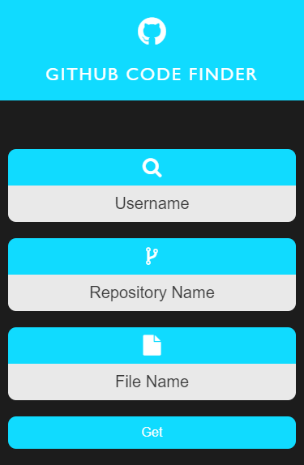

# Github Code Finder
L'applicazione _Github Code Finder_ ti permetterà di accedere a qualsiasi file di Github inserendo il nome utente, il nome o il percorso della repository e il nome del file che si vuole aprire! Niente di più facile e veloce!



Esempio di utilizzo:
1) Username: _AntonioBerna_
2) Repository Name: _Github-Code-Finder/Github Code Finder/js_
3) File Name: _script.js_

Dopo aver premuto sul bottone _Get_ viene visualizzato il contenuto del file:

```
$('form').on('submit', (e) => {
	e.preventDefault();

	let username = $('#username').val();
	let repository = $('#repository').val();
	let filename = $('#filename').val();

	if(username && repository && filename){
		$('.filename, .text-editor').slideDown();
		axios
			.get(`https://cdn.jsdelivr.net/gh/${username}/${repository}/${filename}`)
			.then((res) => {
				$('.text-editor pre').text(res.data);
				$('.filename').text(filename);
				$('#filename').val('');
			})
			.catch((err) => $('.text-editor pre').text('Not Found'));
	}
});

$('.filename, .text-editor').hide();
```
# Per maggiori informazioni

Github Code Finder Application [Youtube]: **IN ARRIVO?!**

Created By Antonio Bernardini Copyright© 2020
